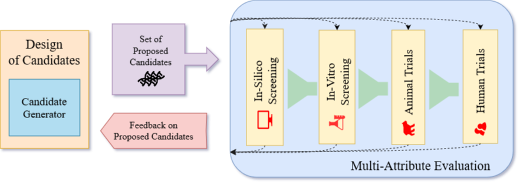

name: title
class: title, middle

## GFlowNets
### A Friendly Introduction and Designing Biological Sequences

.bigger[Moksh Jain and Alex Hernández-García (he/il/él)]

.turquoise[[Deeptails Seminar](https://miai.univ-grenoble-alpes.fr/events-highlights/miai-seminars/) · MIAI Grenoble (virtual) · March 17th 2022]

.center[

]

---

## Collaborators and publications
* Flow Network based Generative Models for Non-Iterative Diverse Candidate Generation
* GFlowNet Foundations
* Biological Sequence Design with GFlowNets
---

## Motivation
.context[Max is not all you need!]
* Scoring functions during search can be unreliable for in silico-search.
    * Capture only a single attribute.
    * Large errors due to approximations and assumptions
* 

.center[]

---

## Don't we have methods to do that already?
### MCMC

---

## Don't we have methods to do that already?
### RL with Entropy Regularization
---

## Generative Flow Networks (GFlowNets)

---

## Flows

---

## Flow consistency

---

## Learning objective

---

## Application
### Active learning for sequence design

---

## Active learning improvements

---

## Results

---

## Looking forward

---

name: title
class: title, middle

## Thank you!

.bigger[Moksh Jain and Alex Hernández-García (he/il/él)]

.turquoise[[Deeptails Seminar](https://miai.univ-grenoble-alpes.fr/events-highlights/miai-seminars/) · MIAI Grenoble (virtual) · March 17th 2022]

.center[

]

