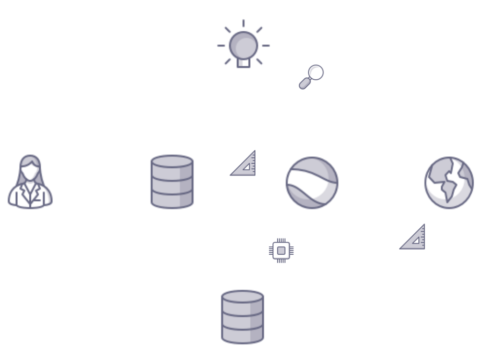

name: title
class: title, middle

## Deep active learning for DNA aptamer design

Alex Hernández-García (he/il/él)

.turquoise[Samsung-Mila-NYU Workshop · Online · Nov. 3rd 2021]

.center[

&nbsp&nbsp&nbsp&nbsp

&nbsp&nbsp&nbsp&nbsp

&nbsp&nbsp&nbsp&nbsp
]

.footer[[alexhernandezgarcia.github.io](https://alexhernandezgarcia.github.io/) | [alex.hernandez-garcia@mila.quebec](mailto:alex.hernandez-garcia@mila.quebec) | [@alexhdezgcia](https://twitter.com/alexhdezgcia)] 

---

## Collaboration

.center[

]

* [Michael Kilgour](https://sites.google.com/view/michael-kilgour/home), Postdoc at NYU, formerly McGill
* Danny Salem, University of Ottawa
* Tao Liu, McGill
* [Miroslava Cuperlovic-Culf](https://med.uottawa.ca/bmi/en/people/cuperlovic-culf-miroslava), University of Ottawa
* [Yoshua Bengio](https://yoshuabengio.org/), Professor at UdeM and Mila
* [Lena Simine](https://www.mcgill.ca/chemistry/faculty/lena-simine), Professor at McGill, Department of Chemistry

.center[

&nbsp&nbsp&nbsp&nbsp

&nbsp&nbsp&nbsp&nbsp

&nbsp&nbsp&nbsp&nbsp
]

---

## Motivation
### DNA aptamers

* DNA aptamers are short, single-stranded nucleotide (ssDNA) sequences.
* DNA aptamers have multiple applications as _aptasensors_ .cite[(Kilgour et al., 2021)]:
    * Antibiotics (Mehlhorn et al., 2018)
    * Neurotransmitters (Sinha et al., 2020)
    * Steroids (Ebrahimi et al., 2021)
    * Metals (Ebrahimi et al., 2017)
    * Proteins (Kirby et al., 2004)
    * Adenosine triphosphate (Huizenga et al., 2004)

---

## Motivation
### DNA aptamers

.right-column-66[.center[]]

---

count: false

## Motivation
### DNA aptamers

.right-column-66[.center[]]

---

count: false

## Motivation
### DNA aptamers

.right-column-66[.center[]]

